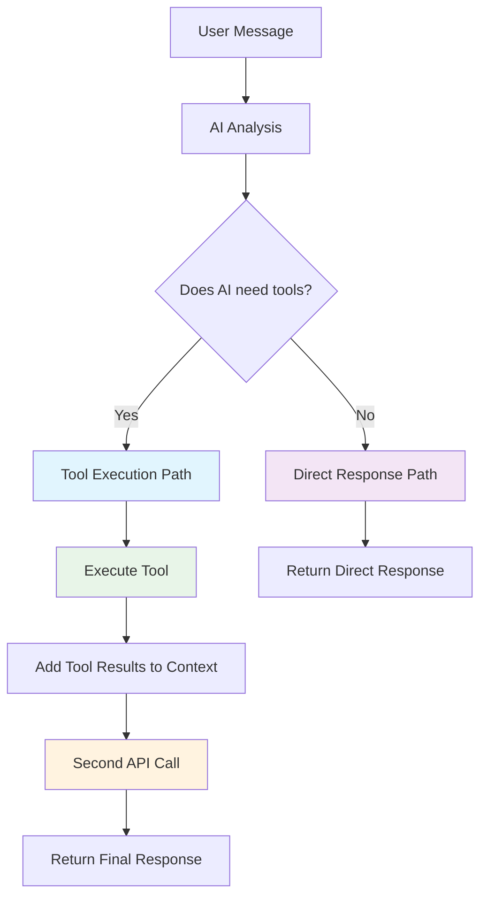
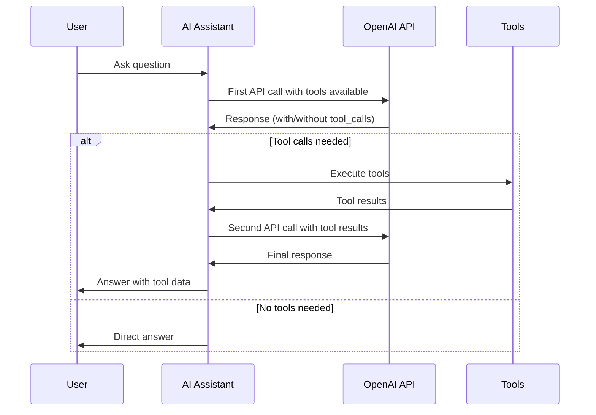

# AI Anjali - Personal AI Assistant

A sophisticated AI-powered personal assistant built with OpenAI's GPT models, featuring PDF document processing, user interaction tracking, and a modern Gradio web interface.

## 🚀 Features

- **PDF Document Processing**: Automatically reads and processes LinkedIn profiles and other PDF documents
- **OpenAI Integration**: Powered by OpenAI's latest GPT models for intelligent conversations
- **User Interaction Tracking**: Records user details and tracks unanswered questions for continuous improvement
- **Push Notifications**: Real-time notifications via Pushover for user interactions
- **Modern Web Interface**: Clean, responsive Gradio-based web UI
- **Tool-based Architecture**: Extensible function calling system for enhanced capabilities

## 📋 Prerequisites

- Python 3.8 or higher
- `uv` package manager (recommended) or `pip`
- OpenAI API key
- Pushover account (optional, for notifications)

## 🛠️ Installation

### Option 1: Using uv (Recommended)

1. **Clone the repository:**
   ```bash
   git clone <your-repo-url>
   cd learning-agentic-ai/1.ai-anjali
   ```

2. **Install dependencies:**
   ```bash
   uv pip install -r requirements.txt
   ```

3. **Run the application:**
   ```bash
   uv run app.py
   ```

### Option 2: Using pip

1. **Clone the repository:**
   ```bash
   git clone <your-repo-url>
   cd learning-agentic-ai/1.ai-anjali
   ```

2. **Create a virtual environment:**
   ```bash
   python -m venv venv
   
   # On Windows:
   venv\Scripts\activate
   
   # On macOS/Linux:
   source venv/bin/activate
   ```

3. **Install dependencies:**
   ```bash
   pip install -r requirements.txt
   ```

4. **Run the application:**
   ```bash
   python app.py
   ```

## 🌐 Hugging Face Spaces Deployment

### Deploying to Hugging Face Spaces:

1. **Create a new Space** on [Hugging Face Spaces](https://huggingface.co/spaces)
2. **Choose Gradio SDK** as your framework
3. **Upload your files** or connect your GitHub repository
4. **Set environment variables** in the Space settings:
   - `OPENAI_API_KEY`: Your OpenAI API key
   - `PUSHOVER_APP_TOKEN`: Your Pushover app token (optional)
   - `PUSHOVER_USER_KEY`: Your Pushover user key (optional)

### Fixing "ModuleNotFoundError: No module named 'openai'":

If you encounter this error in Hugging Face Spaces:

1. **Ensure `requirements.txt` is in the root directory** of your Space
2. **Check the Space logs** for installation errors
3. **Verify the requirements.txt format** - it should contain:
   ```
   openai>=1.0.0
   python-dotenv>=1.0.0
   gradio>=4.0.0
   pypdf>=3.0.0
   requests>=2.31.0
   ```

4. **Restart the Space** after making changes to requirements.txt

### Alternative: Use requirements_hf.txt

If the main requirements.txt doesn't work, rename `requirements_hf.txt` to `requirements.txt` in your Space.

## 🔐 Environment Variables

Create a `.env` file in the project root directory with the following variables:

```bash
# OpenAI Configuration
OPENAI_API_KEY=your_openai_api_key_here

# Pushover Configuration (Optional)
PUSHOVER_APP_TOKEN=your_pushover_app_token
PUSHOVER_USER_KEY=your_pushover_user_key
```

### How to Get API Keys:

#### OpenAI API Key:
1. Visit [OpenAI Platform](https://platform.openai.com/)
2. Sign up or log in to your account
3. Navigate to "API Keys" in the sidebar
4. Click "Create new secret key"
5. Copy the generated key and add it to your `.env` file

#### Pushover (Optional):
1. Visit [Pushover](https://pushover.net/)
2. Create an account and log in
3. Create a new application to get your App Token
4. Your User Key is displayed on the main page
5. Add both keys to your `.env` file

## 📁 Project Structure

```
1.ai-anjali/
├── app.py                 # Main application file
├── requirements.txt       # Python dependencies
├── requirements_hf.txt    # Hugging Face specific requirements
├── .env                  # Environment variables (create this)
├── .gitignore           # Git ignore patterns
├── README.md            # This file
└── me/                  # Personal documents directory
    ├── linkedin.pdf     # LinkedIn profile PDF
    └── summary.txt      # Personal summary text
```

## 🚀 Running the Application

### Quick Start:
```bash
cd learning-agentic-ai/1.ai-anjali
uv run app.py
```

### With Environment Variables:
```bash
# Set environment variables
export OPENAI_API_KEY="your_key_here"
export PUSHOVER_APP_TOKEN="your_token_here"
export PUSHOVER_USER_KEY="your_user_key_here"

# Run the app
uv run app.py
```

### Development Mode:
```bash
# Install in development mode
uv pip install -e .

# Run with auto-reload (if using a tool like nodemon)
uv run app.py
```

## 🌐 Accessing the Application

Once running, the application will be available at:
- **Local URL**: `http://localhost:7860`
- **Network URL**: `http://0.0.0.0:7860`

The Gradio interface will automatically open in your default web browser.

## 🔧 Configuration Options

### Customizing the Assistant:

1. **Personal Information**: Update the `Me` class in `app.py`:
   ```python
   class Me:
       def __init__(self):
           self.name = "Your Name"  # Change this
           # ... other configurations
   ```

2. **PDF Documents**: Replace `me/linkedin.pdf` with your own documents
3. **Personal Summary**: Update `me/summary.txt` with your information

### Adding New Tools:

The application supports extensible tool-based architecture. Add new tools by:

1. Creating a new function
2. Adding it to the `tools` list
3. Implementing the `handle_tool_call` method

## 📊 Monitoring and Analytics

The application automatically tracks:
- User interactions and contact information
- Unanswered questions for continuous improvement
- Tool usage patterns

All interactions are logged and can be monitored through the console output.

## 🧠 Developer Guide

### Architecture Overview

AI Anjali uses a sophisticated tool-based architecture with OpenAI function calling. The system intelligently decides when to use tools vs. providing direct responses.

#### Tool Calling Decision Flow



#### Detailed Tool Calling Logic



#### When Tools Are Used

| Scenario | User Input | Tool Used | Why |
|----------|------------|-----------|-----|
| Contact Request | "I want to contact Anjali" | `record_user_details` | Needs to collect user information |
| Unanswerable Question | "What's quantum computing?" | `record_unknown_question` | Can't answer from available data |
| Simple Question | "What's Anjali's experience?" | None | Can answer directly from LinkedIn/summary |

#### Tool Structure

Each tool follows the OpenAI function calling standard:

```python
{
    "type": "function",
    "function": {
        "name": "tool_name",
        "description": "Clear description of what the tool does",
        "parameters": {
            "type": "object",
            "properties": {
                "param_name": {
                    "type": "string|number|boolean",
                    "description": "Parameter description"
                }
            },
            "required": ["param_name"]
        }
    }
}
```

#### Key Components

- **`tool_choice="auto"`**: AI automatically decides when to use tools
- **`temperature=0.7`**: Balanced creativity for professional responses
- **Two-path system**: Tool execution or direct response based on AI analysis
- **Context preservation**: Tool results are added to conversation history

## 🐛 Troubleshooting

### Common Issues:

1. **OpenAI API Key Error**:
   - Ensure your `.env` file exists and contains the correct API key
   - Verify the API key is valid and has sufficient credits

2. **PDF Reading Error**:
   - Ensure the PDF file exists in the `me/` directory
   - Check that the PDF is not password-protected

3. **Import Errors**:
   - Verify all dependencies are installed: `uv pip install -r requirements.txt`
   - Check Python version compatibility

4. **Port Already in Use**:
   - The default port is 7860. If busy, Gradio will automatically find an available port

5. **Hugging Face Spaces Module Error**:
   - Ensure `requirements.txt` is in the root directory
   - Check Space logs for installation errors
   - Restart the Space after updating requirements

### Debug Mode:

Enable debug logging by setting:
```bash
export PYTHONPATH="${PYTHONPATH}:$(pwd)"
export DEBUG=1
```

## 🔒 Security Considerations

- **Never commit your `.env` file** - it's already in `.gitignore`
- **API Key Management**: Use environment variables, never hardcode API keys
- **PDF Content**: Be mindful of sensitive information in your PDF documents
- **User Data**: All user interactions are logged locally

## 📝 Dependencies

The project uses the following key dependencies:

- **openai**: OpenAI API client for GPT model interactions
- **gradio**: Web interface framework
- **pypdf**: PDF document processing
- **python-dotenv**: Environment variable management
- **requests**: HTTP client for external API calls

## 🤝 Contributing

1. Fork the repository
2. Create a feature branch: `git checkout -b feature-name`
3. Commit your changes: `git commit -am 'Add feature'`
4. Push to the branch: `git push origin feature-name`
5. Submit a pull request

## 🆘 Support

For issues and questions:
1. Check the troubleshooting section above
2. Review the console output for error messages
3. Ensure all environment variables are properly set
4. Verify your OpenAI API key has sufficient credits

## 🔄 Updates

To update the project:
```bash
git pull origin main
uv pip install -r requirements.txt --upgrade
```

---

**Note**: This is a personal AI assistant project. Customize the content, tools, and interface to match your specific needs and preferences.
